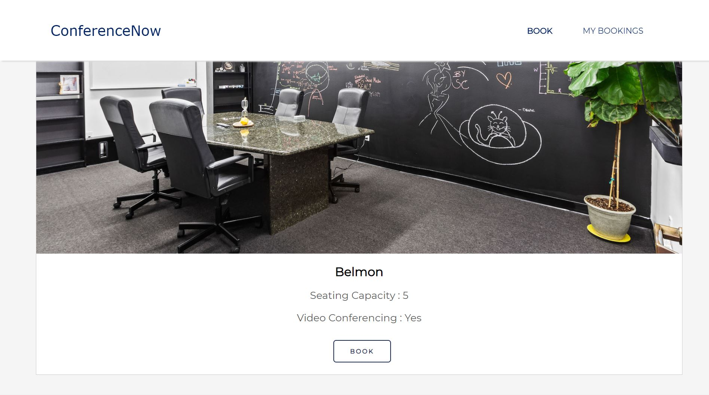
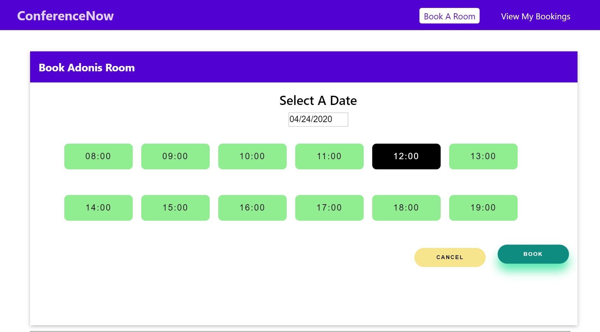
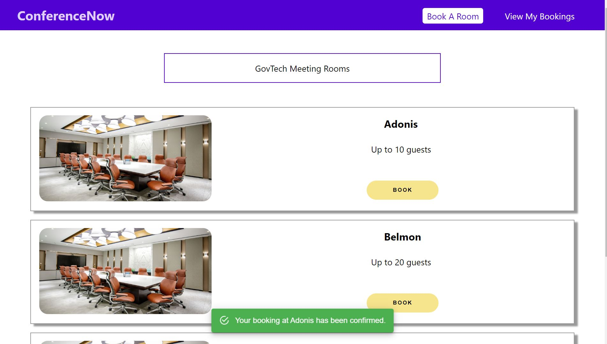
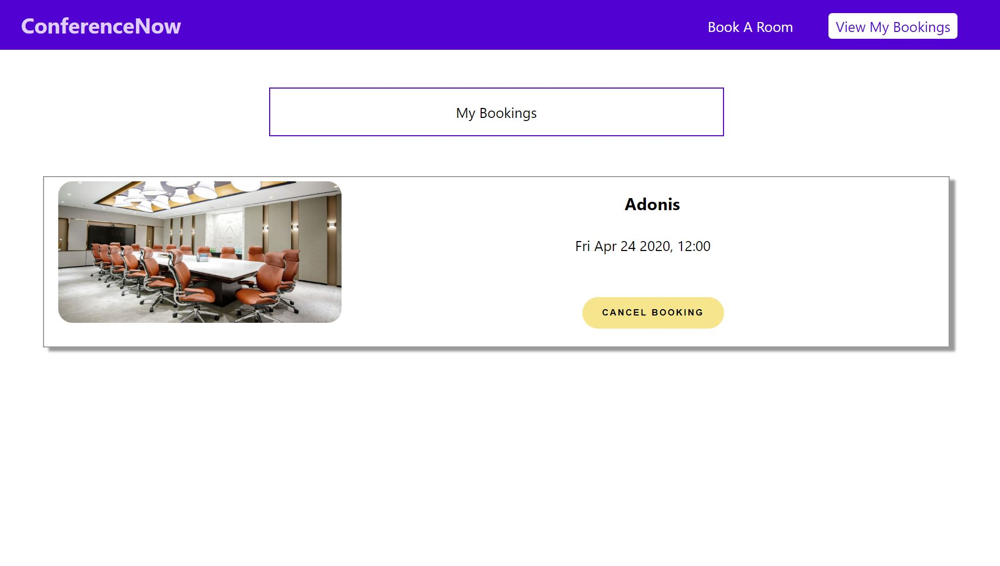
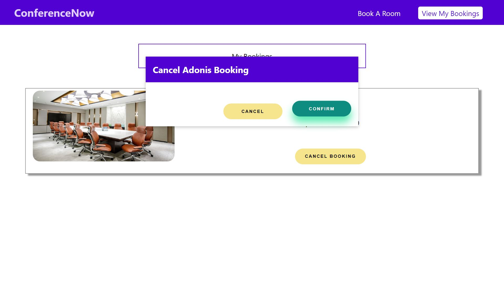
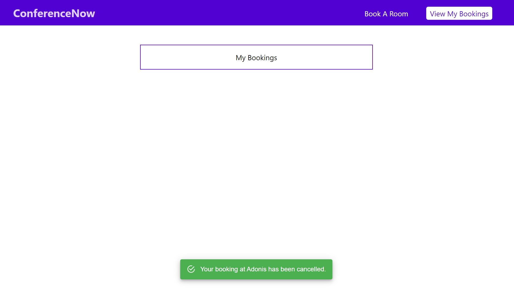

## 💻 Tech Stack 💻
These are the key ⚒ frameworks and tools ⚒ which were used extensively during the development of 🤝 ConferenceNow 🤝.

* [React]([https://reactjs.org/](https://reactjs.org/)), one of the most popular frontend 🌐-development frameworks in the market today.

* [NodeJS]([https://nodejs.org/en/](https://nodejs.org/en/)), to handle our backend logic, the 🧠 of the application.

* [HTML / CSS / JavaScript](https://www.javascript.com/), to make the website 🌺🎉💥!

  

## 📸 Usage & Demo 📸
  
  
  
  
  
  

## 🍻 Contributing 🍻

Contributions are what make the open source community such an amazing place to be learn, inspire, and create. Any contributions you make are **greatly appreciated**.

1. Fork the Project
2. Create your Feature Branch (`git checkout -b feature/AmazingFeature`)
3. Commit your Changes (`git commit -m 'Add some AmazingFeature'`)
4. Push to the Branch (`git push origin feature/AmazingFeature`)
5. Open a Pull Request
  

<!-- LICENSE -->
## 📑 License 📑

Distributed under the MIT License. See `LICENSE` for more information.
  

## 📞 Contact 📞
📛 **Wei Lun**

🔗 [LinkedIn](https://www.linkedin.com/in/tan-wei-lun/)

📧 [Email](mailto:WTAN132@e.ntu.edu.sg)

  
